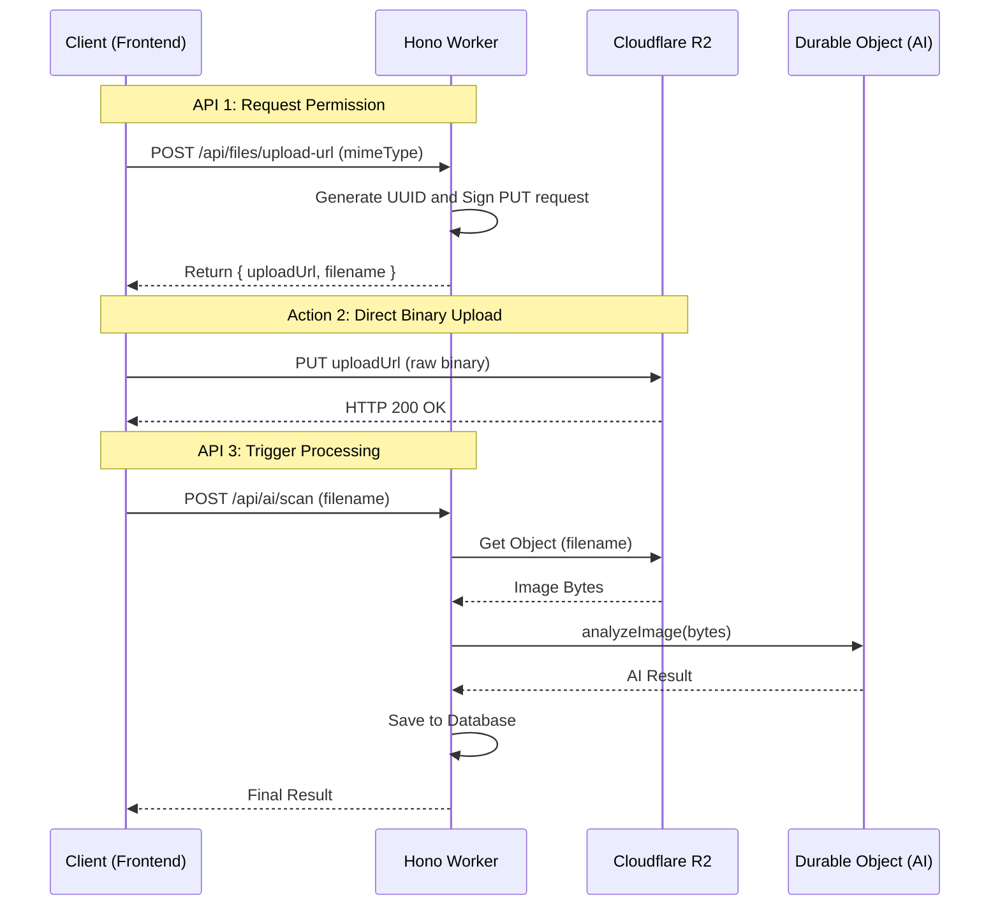

# Cloudflare R2: Direct Client Upload Flow (Signed URLs)

Merging your current "multipart" upload into a "direct-to-bucket" flow will improve performance and scalability. Here is the recommended 3-step architecture.

## 1. High-Level Flow



---

## 2. Prerequisites (Cloudflare Setup)

### A. R2 API Tokens
Go to **R2 -> Manage R2 API Tokens** and create a token with **Edit** access. You will needs these in your [wrangler.toml](file:///home/phuoc/Ho%20Phuoc/hono-workers/wrangler.toml) or as secrets:
*   `R2_ACCESS_KEY_ID`
*   `R2_SECRET_ACCESS_KEY`
*   `R2_ENDPOINT` (e.g., `https://<account-id>.r2.cloudflarestorage.com`)

### B. CORS Configuration
In the Cloudflare dashboard, go to your R2 bucket **Settings -> CORS Policy** and add:
```json
[
  {
    "AllowedOrigins": ["http://localhost:3000", "https://yourdomain.com"],
    "AllowedMethods": ["PUT", "GET"],
    "AllowedHeaders": ["content-type"],
    "MaxAgeSeconds": 3600
  }
]
```

---

## 3. Implementation Details

### API 1: Generate Signed URL (Worker)
Use a library like `aws4fetch` (lightweight for Workers) to sign the URL.

```typescript
// Example inside your Hono route
const r2 = new AwsClient({
  accessKeyId: c.env.R2_ACCESS_KEY_ID,
  secretAccessKey: c.env.R2_SECRET_ACCESS_KEY,
});

const filename = `${crypto.randomUUID()}.jpg`;
const url = `${c.env.R2_ENDPOINT}/${c.env.BUCKET_NAME}/uploads/${filename}`;

const signed = await r2.sign(url, {
  method: 'PUT',
  headers: { 'Content-Type': 'image/jpeg' },
  aws: { signQuery: true }, // Important: sign via query params
});

return c.json({ uploadUrl: signed.url, filename });
```

### Action 2: Direct Upload (Frontend)
The frontend uses the URL directly. **No specific headers except Content-Type are needed** (they are already in the signature).

```javascript
// Browser code
await fetch(uploadUrl, {
  method: 'PUT',
  body: fileBlob,
  headers: { 'Content-Type': 'image/jpeg' }
});
```

### API 3: AI Scan (Worker)
Instead of accepting a `multipart/form-data`, this API accepts a simple JSON body.

```typescript
// POST /api/ai/scan
const { filename } = await c.req.json();

// 1. Fetch from R2 using the standard binding
const object = await c.env.BUCKET.get(`uploads/${filename}`);
if (!object) return c.json({ error: 'File not found' }, 404);

// 2. Process with AI
const buffer = await object.arrayBuffer();
const result = await aiService.analyzeImage(buffer, object.httpMetadata.contentType);
```

---

## 4. Why This Architecture?
1.  **No Memory Bloat**: Your Worker doesn't have to hold the entire image in memory during upload.
2.  **Faster Response**: The client gets the "upload permit" instantly.
3.  **Scalable**: You can handle thousands of concurrent uploads without saturating Worker CPU.
